# Sistema web del Centro de Terapias Alternativas Termo Oasis 

_Frontend_ del sistema web del centro Termo Oasis que incluye funciones para dos roles de usuarios, secretaria y doctor.

Las funciones comunes para ambos roles son:
- Mostrar la información del negocio en una Landing page
- Iniciar sesión
- Recuperar contraseña
- Restablecer contraseña
- Ver el perfil del usuario

Las funciones exclusivas para el rol secretaria son: 
- Gestionar citas (agendar, ver, modificar y cancelar citas)
- Gestionar pacientes (registrar, ver y eliminar pacientes)

Las funciones exclusivas para el rol doctor son: 
- Ver las citas agendadas
- Ver a los pacientes registrados en el centro
- Gestión de registros médicos (crear, ver y actualizar registros)

**Despliegue:** https://termooasis.netlify.app/

## Tecnologías usadas en el proyecto 

| Tecnología       | Descripción                        | Ícono                                                                                                                                     |
|------------------|------------------------------------|-------------------------------------------------------------------------------------------------------------------------------------------|
| **Git**          | Sistema de control de versiones    | <p align="center"></p>                              |
| **Node.js**      | Entorno de ejecución de JavaScript | <p align="center"></p>                          |
| **JavaScript**   | Lenguaje de programación           | <p align="center"></p>               |
| **React**        | Framework de JavaScript            | <p align="center"></p> |
| **Tailwind CSS** | Framework de CSS                   | <p align="center"></p> |

## Ejecución 

1. Clona el proyecto

```bash
git clone https://github.com/SanguchoMela/frontend-TO_v1.git
```

2. Cambia al directorio del proyecto

```bash
cd frontend-TO_v1
```

3. Instala las dependencias

```bash
npm install
```
4. Configura las [variables de entorno](#variables-de-entorno)

5. Ejecuta el proyecto localmente

```bash
npm run dev
```

## Variables de entorno

Para ejecutar este proyecto, necesitas añadir las siguientes variables de entorno a tu archivo `.env`

Este archivo se debe ubicar en la raíz de la carpeta del componente. `frontend-TO_v1\.env`

- **Conexión con el backend:** `VITE_BACKEND_URL = url_backend`

> [!note]
> El backend que se desarrolló a la par de este componente lo puedes encontrar en el repositorio [Backend Termo Oasis](https://github.com/edusebass/backendTermoOasis.git)

## Capturas de pantalla

### Interfaces

- Landing page

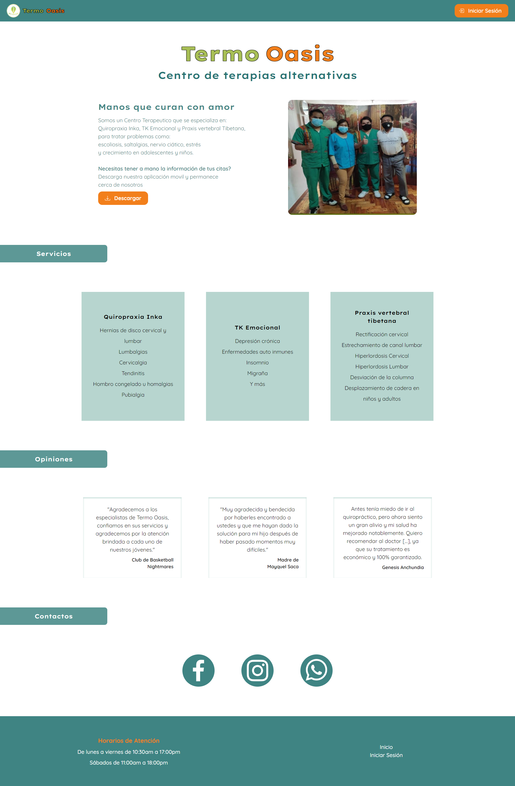

- Iniciar sesión

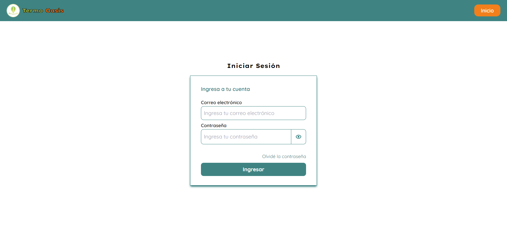

- Recuperar contraseña

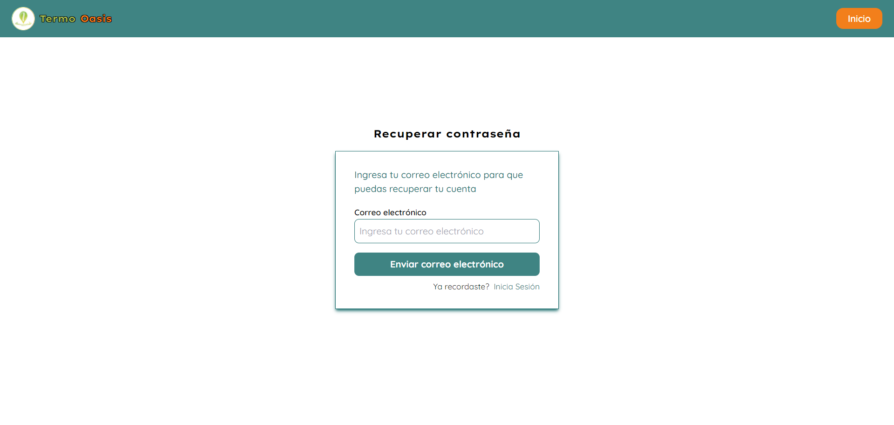

- Restablecer contraseña

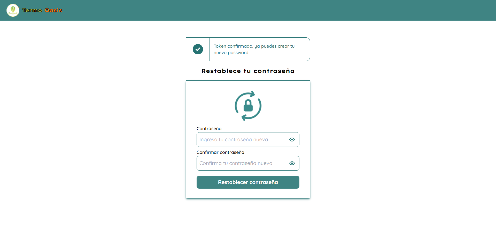

- Mi perfil

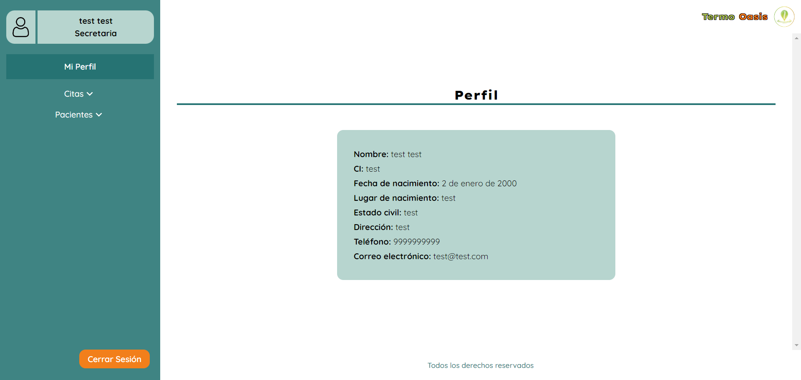

- Agendamiento de citas

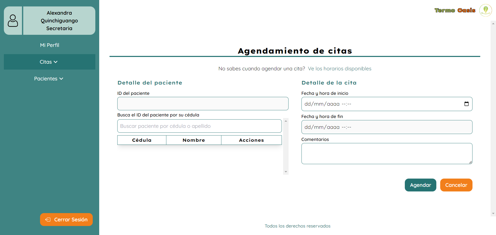

- Calendario de citas

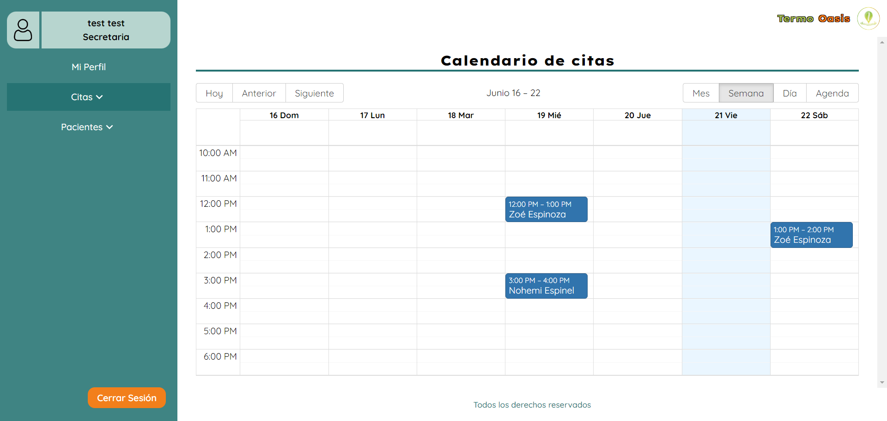

- Registrar paciente

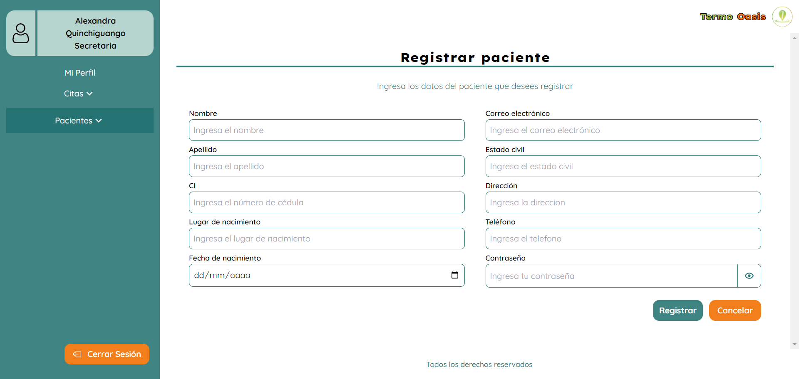

- Lista de pacientes

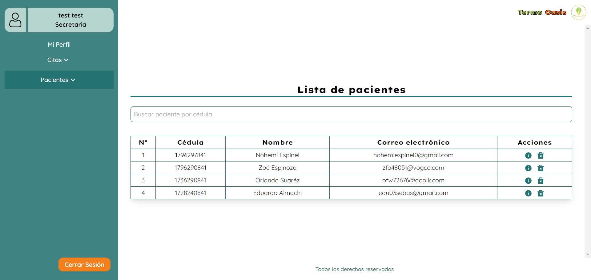

- Perfil del paciente - rol secretaria

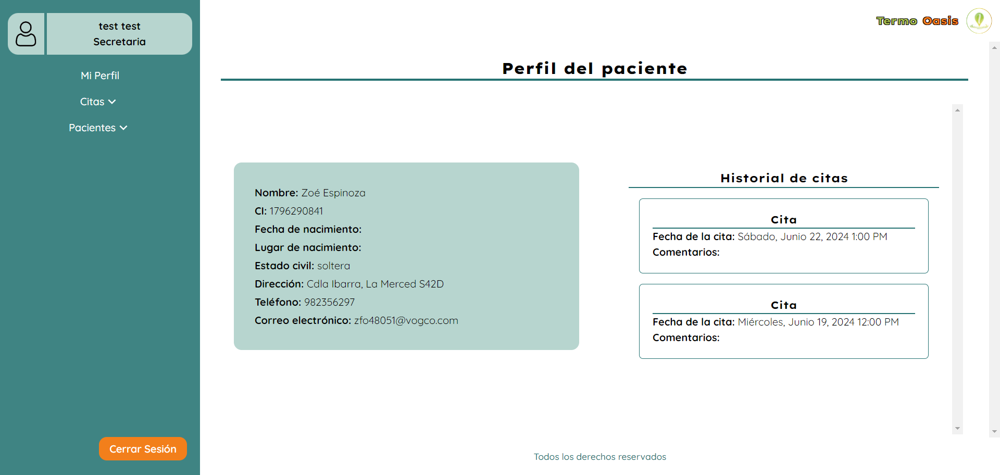

- Perfil del paciente - rol doctor

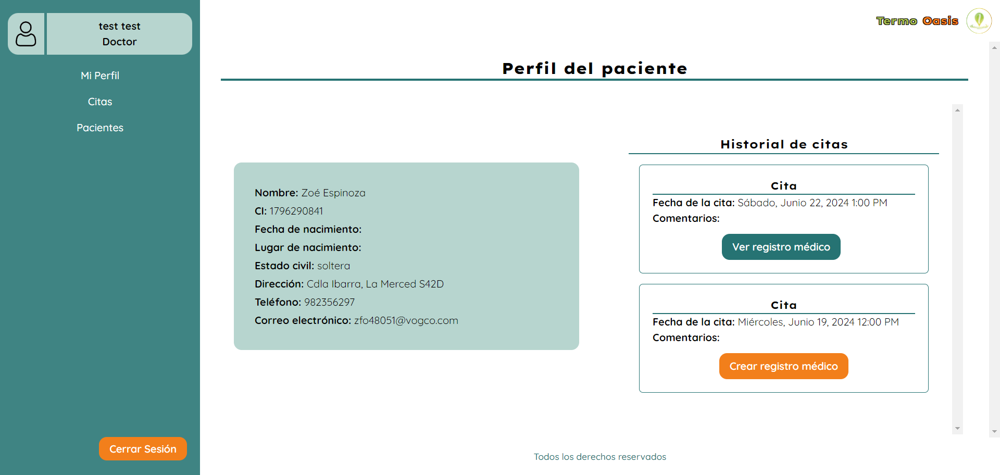

### Modales

- Detalles de la cita

  <p align="center">
    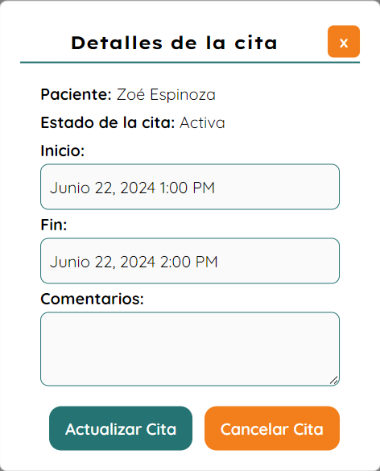
  </p>

- Crear registro médico

  <p align="center">
    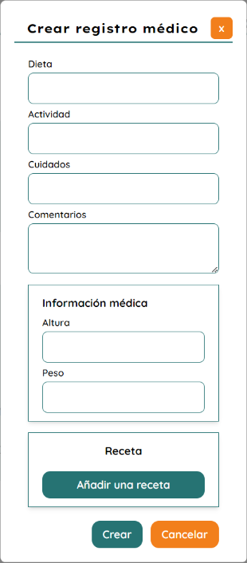
  </p>

- Ver registro médico

  <p align="center">
    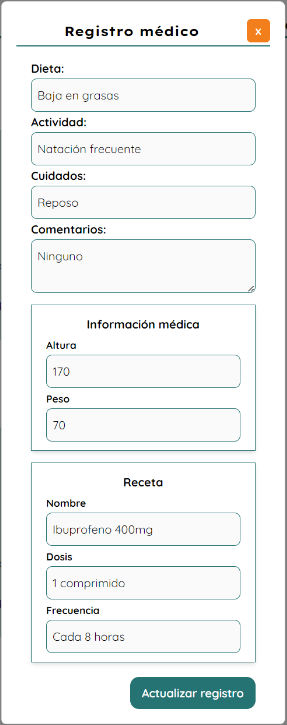
  </p>

